# 1. Student Registration System

A simple web system built with Laravel where a student can register online, upload a
profile picture, and have their information saved in a database. This project is for
**ITST 302 – Client-Server Technologies, Week 4 Laboratory Activity (Mini Project 03)**.

---

## 2. Introduction

Schools, companies, hospitals, and government offices all need a way to collect and
manage information about the people who use their services. A registration system is
one of the most common tools for this.

**Why is a Student Registration System needed?**
It lets the College of Information Technology move away from paper forms and collect
student information online instead. This makes registration faster, saves paper, and
keeps records organized in one place.

**Why is data validation important?**
Validation checks that the information a student types in is correct before it is
saved. For example, it makes sure the email is a real email format, the student ID is
not already used, and a profile picture is actually attached. Without validation, the
database could end up with missing, duplicate, or wrong information.

**Why do enterprise systems need this?**
Big systems like banks, hospitals, and universities all collect user information
before giving access to their services. A registration module like this one is the
starting point for those bigger systems.

---

## 3. Objectives

Objectives that I have accomplished during the activity:

- Build a registration form using Blade templates.
- Handle form submissions using a Laravel controller.
- Add validation rules so only correct data gets saved.
- Show success and error messages to the user.
- Upload and store a profile picture safely using Laravel Storage.
- Create a database table using Laravel Migrations.
- Write clear documentation using Markdown.
- Use Git and GitHub to track my progress and build a portfolio.

---

## 4. Laravel Request Lifecycle

This shows the path a registration request takes, from the moment the student opens
the page to the moment they see their saved profile.

1. **Browser** – the student opens the registration page and submits the form.
2. **Route** – Laravel checks `routes/web.php` to know which controller should handle
   this request.
3. **Controller** – the `StudentController` receives the request.
4. **Validation** – Laravel checks if all the required fields are filled in correctly.
5. **Model** – if the data is valid, the `Student` model saves it.
6. **Database** – the record is stored in the `students` table in MySQL.
7. **Response** – Laravel sends a response back to the browser, either a success page or the form again with error messages.

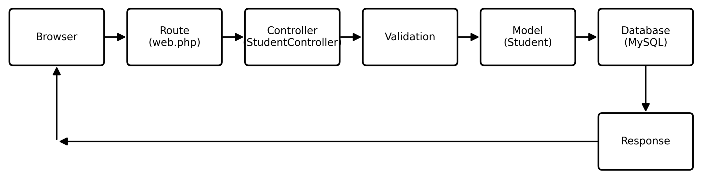

---

## 5. Validation Rules

Here are the rules used in this project and why each one matters:

| Rule | What it does | Why it matters |
|---|---|---|
| `required` | Field cannot be left empty | Makes sure important information is not missing |
| `unique` | No two students can have the same value | Used for Student ID and Email so no two records look the same |
| `email` | Checks the text looks like a real email | Prevents fake or broken email addresses |
| `numeric` | Only accepts numbers | Used for mobile number so letters cannot be typed in |
| `image` | Only accepts picture files | Makes sure the uploaded file is really a photo |
| `mimes:jpg,jpeg,png` | Only allows these file types | Blocks unsafe or unsupported file formats |
| `max:2048` | Limits file size to 2MB | Keeps the server storage from filling up too fast |

Validation is important because it protects the database from bad data and protects
the system from harmful files being uploaded.

---

## 6. Database Design

### Entity Relationship Diagram (ERD)

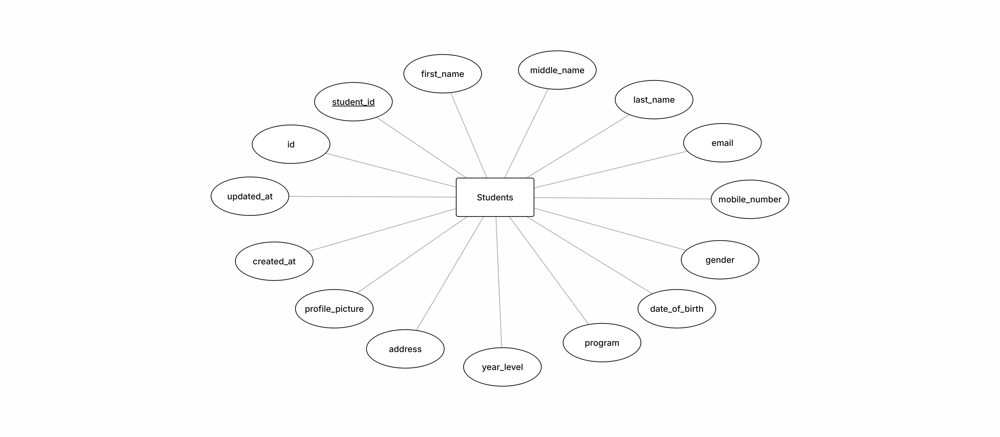

### Table Structure

| Column | Data Type | Constraint |
|---|---|---|
| id | BIGINT | Primary Key, Auto Increment |
| student_id | VARCHAR | Required, Unique |
| first_name | VARCHAR | Required |
| middle_name | VARCHAR | Optional |
| last_name | VARCHAR | Required |
| email | VARCHAR | Required, Unique |
| mobile_number | VARCHAR | Required |
| gender | VARCHAR | Required |
| date_of_birth | DATE | Required |
| program | VARCHAR | Required |
| year_level | VARCHAR | Required |
| address | TEXT | Required |
| profile_picture | VARCHAR | Required (stores file path only) |
| created_at | TIMESTAMP | Auto-filled by Laravel |
| updated_at | TIMESTAMP | Auto-filled by Laravel |

**Primary Key:** `id`
**Unique Constraints:** `student_id`, `email`

---

## 7. Flowchart

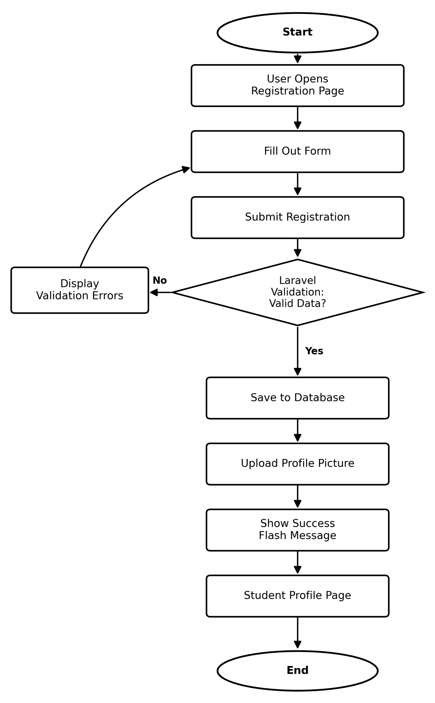

---

## 8. Screenshots

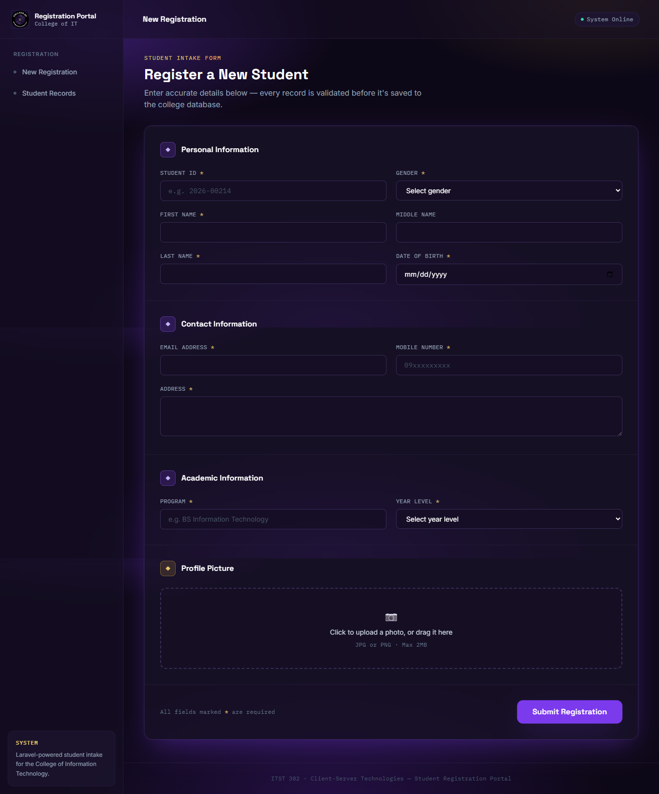
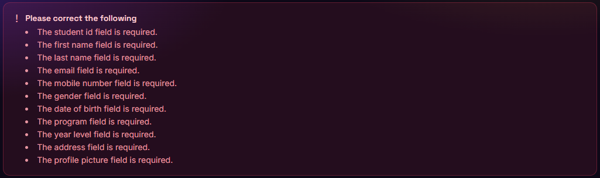
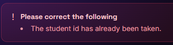
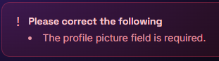
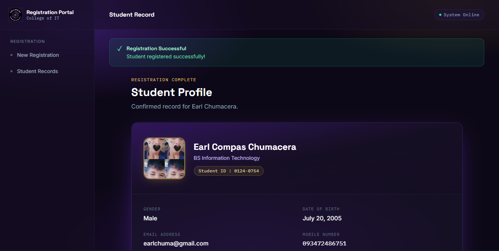

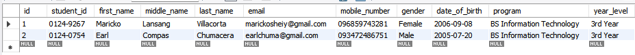
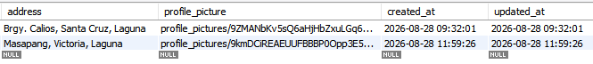
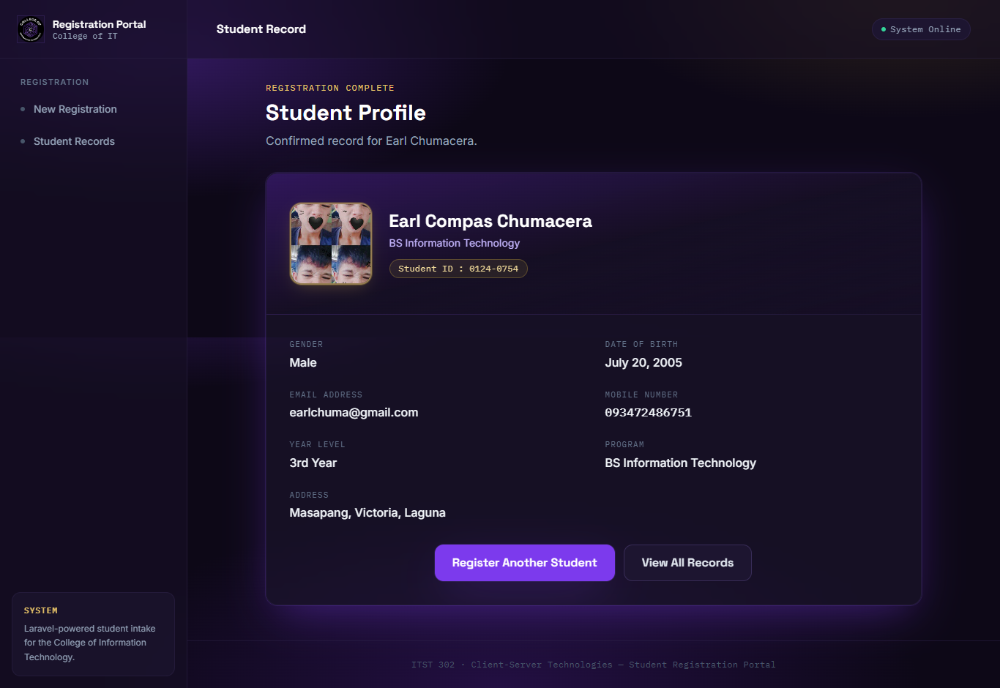
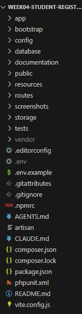
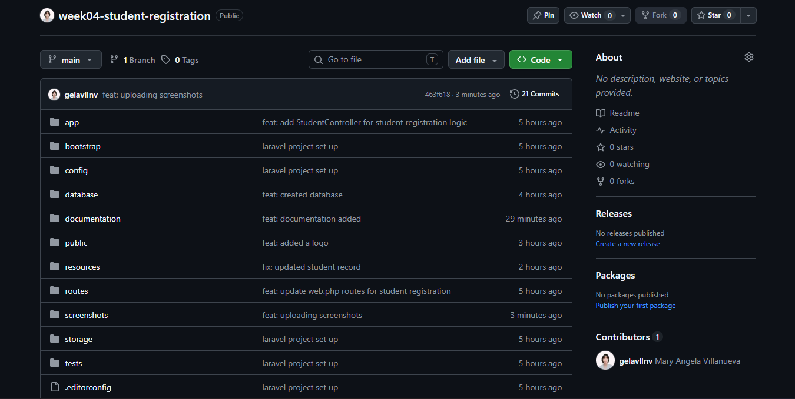

---

## 9. Problems Encountered

1. **Problem:** The validation error messages were not showing on the form.
   **Cause:** The Blade file did not have the code to check and display
   `$errors`. Because of this, even when Laravel found a mistake in the
   input, nothing appeared on the screen to tell the user.

2. **Problem:** The uploaded profile picture was not showing on the student's
   profile page. It only showed a broken image icon.
   **Cause:** The storage symbolic link was missing. I forgot to run
   `php artisan storage:link`, so the browser could not find the image file
   even though it was already saved inside `storage/app/public`.

3. **Problem:** The form said the email or student ID was "already taken"
   even on the very first try.
   **Cause:** I ran the migration twice by accident, which added old test
   data back into the table, so the new entry looked like a duplicate.

---

## 10. Solutions

1. **Solution:** I added an `@if ($errors->any())` block in the Blade
   template to loop through and display every validation error message
   clearly above the form.
2. **Solution:** I ran `php artisan storage:link` in the terminal. This
   created the missing link between the `storage` and `public` folders, so
   uploaded images could finally be viewed in the browser.
3. **Solution:** I ran `php artisan migrate:fresh` to clear the table and
   start with a clean, empty database before testing the form again.

---

## 11. Reflection

Building this Student Registration System taught me how important validation is in a
real application. Before this project, I thought validation was just about stopping
empty fields, but I learned it does much more than that. It protects the whole system
from bad data, wrong file types, and duplicate records. A single missing rule, like
forgetting to check if an email is unique, could let two students share one account by
mistake.

I also learned a lot about handling user input. Users do not always type what a system
expects. Some may leave fields blank, type letters in a number field, or upload the
wrong kind of file. Laravel's validation rules made it possible to catch these mistakes
before they ever reached the database. This showed me that a good system should never
fully trust what a user submits, it should always double check.

One of the biggest lessons was understanding the difference between client-side and
server-side validation. Client-side validation, like HTML's `required` attribute, is
helpful because it gives instant feedback to the user. But it is not safe on its own,
since anyone can bypass it by editing the browser or turning off JavaScript.
Server-side validation, which Laravel handles in the controller, is the real
protection because it runs on the server where the user cannot change it. This project
made it clear that both should be used together, but server-side validation is the one
that truly keeps the system safe.

File security was another important part of this project. Uploading a profile picture
is not as simple as just saving whatever file the user sends. The system needs to check
that the file is really an image, limit its size, and store it in a proper folder so it
cannot be used to attack the server. Using Laravel Storage and the `storage:link`
command helped me understand how frameworks organize uploaded files safely, instead of
saving them directly in a public folder.

Finally, this activity helped me see how registration systems are used in real
enterprise software. Every time someone signs up for a bank account, applies for a job
online, or registers for a class, a system like this one is working in the background.
It validates the input, stores it securely, and gives feedback to the user. Building a
small version of this for a Student Registration System gave me a better appreciation
for how much thought goes into something that looks simple on the surface. This project
strengthened both my technical skills in Laravel and my understanding of why good
input handling matters in any software I build in the future.

---

## 12. References

Laravel. (2024). *Laravel 11.x documentation*. Laravel. https://laravel.com/docs

PHP Group. (2024). *PHP manual*. PHP. https://www.php.net/manual/en/

MySQL. (2024). *MySQL 8.0 reference manual*. Oracle Corporation. https://dev.mysql.com/doc/

Tailwind Labs. (2024). *Tailwind CSS documentation*. Tailwind CSS. https://tailwindcss.com/docs

Mozilla Contributors. (2024). *MDN Web Docs*. Mozilla. https://developer.mozilla.org/
